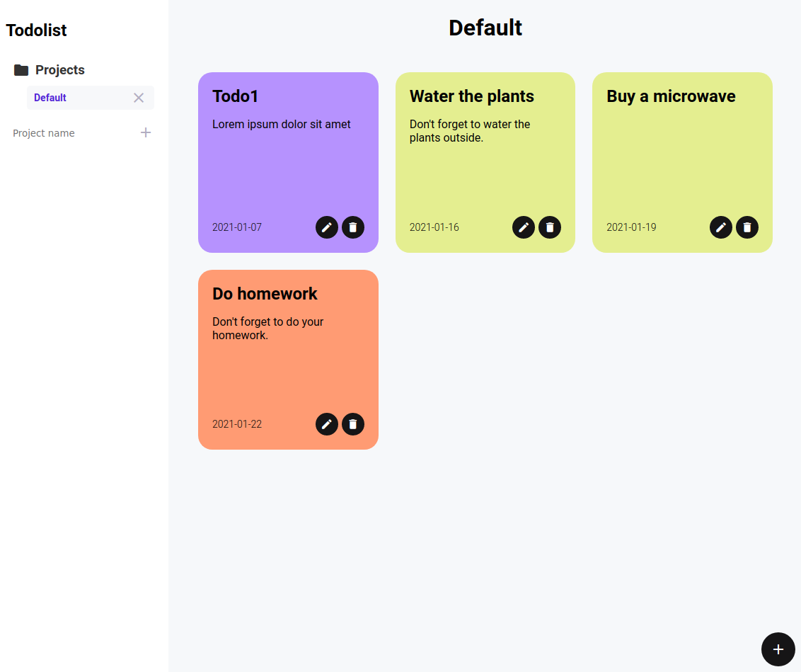

# Todolist

 

> A simple todolist app

## Table of Contents
- [Todolist](#todolist)
  - [Table of Contents](#table-of-contents)
  - [Live demo](#live-demo)
  - [Built With](#built-with)
  - [how to run locally](#how-to-run-locally)
  - [Authors](#authors)
  - [🤝 Contributing](#-contributing)
  - [Show your support](#show-your-support)
  - [Acknowledgments](#acknowledgments)
    - [Design inspiration](#design-inspiration)
  - [📝 License](#-license)

## [Live demo](https://raw.githack.com/WinterCore/microverse-todolist/a19e4e726036cf68a57acd68cbb51439aea242a9/dist/index.html)

## Built With

- Typescript
- HTML
- CSS

## how to run locally

- Install [Node.js](https://nodejs.org/en/download/)
- Clone this repository by running `git@github.com:WinterCore/microverse-todolist.git`
- Change your current working directory to the project `cd microverse-todolist`
- Run `npm install`
- Run `npm start`
- Enjoy

## Authors

👤 WinterCore

- Github: [@WinterCore](https://github.com/WinterCore)

## 🤝 Contributing

Contributions, issues and feature requests are welcome!

Feel free to check the [issues page](issues/).

## Show your support

Give a ⭐️ if you like this project!

## Acknowledgments

### Design inspiration
- https://dribbble.com/shots/14037848-Docket-note-Side-menu
- https://dribbble.com/shots/14440819-KosmoTime-Task-Manager

## 📝 License

This project is [MIT](LICENSE) licensed.